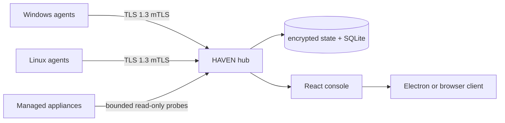

<p align="center">
  
</p>

<h1 align="center">HAVEN</h1>

<p align="center"><strong>Home Asset Visibility, Events &amp; Network Security</strong></p>

<p align="center">
  A self-hosted security observatory for understanding trusted computers,
  private-network services, managed appliances, browsers, and account hygiene.
</p>

<p align="center">
  <a href="https://go.dev/"></a>
  <a href="https://react.dev/"></a>
  <a href="https://www.typescriptlang.org/"></a>
  <a href="https://www.electronjs.org/"></a>
  <a href="https://www.sqlite.org/"></a>
  <a href="https://www.docker.com/"></a>
</p>

<p align="center">
  <a href="https://github.com/AdamWentworth/Haven/actions/workflows/ci.yml"></a>
  <a href="LICENSE"></a>
</p>

HAVEN turns native security evidence into one explainable household view without replacing Microsoft Defender, Linux firewalls, browser protections, or other trusted controls. A Go hub receives mutually authenticated reports from native Windows and Ubuntu agents, while the React console and hardened Electron client keep observation, review, and deliberately narrow actions understandable. Collection remains read-only, but the packaged Windows reporter runs elevated so protected posture signals are not silently omitted.

> [!IMPORTANT]
> HAVEN is pre-release personal infrastructure, not an antivirus, password manager, SIEM, or provider-session authority. It never stores passwords, cookie values, recovery codes, authenticator seeds, packet payloads, or arbitrary remote commands. Public demos must use synthetic data.

---

## ✨ Highlights

- **Cross-platform posture** — explainable Windows and Ubuntu security checks, host-firewall verification, updates, protection state, and authenticated report freshness.
- **Service-aware networking** — logical listeners, live connections, systemd and Docker attribution, and owner-reviewed expected-service baselines without packet capture.
- **Managed appliance health** — explicit, credential-bounded NAS reachability, capacity, disk, temperature, storage-set, and firmware evidence.
- **Browser hardening** — privacy-bounded browser, extension, and cookie-domain metadata with finite cleanup and incident guidance—never cookie contents.
- **Account hygiene notebook** — encrypted owner-reported MFA, recovery, backup-code, and session-review checklists without provider credentials.
- **Evidence-based alerting** — alerts derive only from current verified posture, authenticated freshness, and reviewed service expectations; they never claim an attack occurred.
- **Constrained control plane** — fixed, capability-advertised actions require a fresh passkey and cannot become an arbitrary shell.
- **Portable by design** — reusable public product code remains separate from private network configuration and recoverable local state.
- **Operationally explainable** — authenticated system diagnostics, redacted recovery guidance, and read-only hub/agent doctor commands distinguish repair from re-enrollment.

Start with the [installation and support guide](docs/GETTING_STARTED.md). The [architecture](docs/ARCHITECTURE.md), [threat model](docs/THREAT_MODEL.md), [verification map](docs/VERIFICATION.md), and [portability guide](docs/PORTABILITY.md) document the evidence and boundaries behind those claims.

| Component | Supported now | Not yet supported |
| --- | --- | --- |
| Hub | Source execution on Windows and Ubuntu; hardened Linux container | Turnkey production DNS/TLS/firewall provisioning |
| Endpoint agent | Windows and Ubuntu | macOS; fully generic Linux-distribution parity |
| Owner client | Modern browser; Windows Electron installer | Signed Linux or macOS desktop packages |

The public clone is a complete product source tree, not a copy of one household. It can run a loopback development hub immediately; a multi-device production installation still requires an owner-supplied private deployment layer and deliberate enrollment of every endpoint.

## Current scope

HAVEN is currently a pre-release project. Its supported surfaces are summarized above; precise security claims and their automated evidence live in the [verification map](docs/VERIFICATION.md). Operational boundaries belong in the [architecture](docs/ARCHITECTURE.md), [threat model](docs/THREAT_MODEL.md), and focused setup guides instead of a duplicated feature ledger in this README.

---

## 🧱 System design

| Layer | Technology | Responsibility |
| --- | --- | --- |
| Hub | Go, SQLite | Authentication, encrypted owner state, history, alert projection, appliance observation, and embedded web assets |
| Endpoint agent | Go, native OS collectors | Read-only collection and mutually authenticated outbound reporting |
| Console | React, TypeScript, Vite | Routed household, device, network, browser, account, activity, and settings workspaces |
| Desktop client | Electron | Sandboxed, exact-origin Windows client with no Node, preload, filesystem, shell, or IPC bridge |
| Production | Docker image plus private operations configuration | Resource-bounded hub deployment; endpoint agents remain native |



The hub is centralized; collection is not. Each enrolled machine observes itself with native APIs, then sends a bounded snapshot to the hub. Production network coordinates and authority remain in a separate private deployment layer.

---

## 🚀 Run locally on Windows

For the complete cross-platform support matrix, production boundary, and endpoint enrollment sequence, use [Getting started](docs/GETTING_STARTED.md). This section is the shortest Windows source-development path.

Requirements:

- Go 1.26.6 or later
- Node.js 24 or another version supported by the pinned frontend toolchain
- Windows PowerShell with the built-in Defender and NetSecurity modules

Build the web application and run the hub:

```powershell
Set-Location .\web
npm ci
npm run build
Set-Location ..
go run .\cmd\haven-hub
```

Open <http://localhost:5080>. The hub binds to loopback by default and writes its development database to the operating system's per-user application-data directory, outside the repository. The `localhost` name is required because browsers grant WebAuthn's local-development secure-context exception to localhost, not arbitrary loopback IP literals.

## 🖥️ Install the desktop experience

The native desktop package lives in `desktop`. It opens the production private HTTPS origin in a dedicated sandboxed Electron window and uses the same hub authentication, account lock, and server-delivered updates. It is a client—not another hub or endpoint agent—and it exposes no Node.js, filesystem, shell, preload, or IPC bridge to the dashboard.

For local verification on Windows:

```powershell
Set-Location .\desktop
npm ci
npm test
npm run check
npm run dist:windows
npm run verify:fuses
```

The generated current-user installer is placed under `desktop\dist`. Development installers are intentionally unsigned and Windows will therefore identify the publisher as unknown; code signing is required before general public distribution. The existing browser-installed application remains a smaller fallback: open HAVEN in a compatible browser, visit **Settings → Install HAVEN**, and use the offered button or the browser's app menu. Both clients remain connected to the same hub, and hub monitoring continues while either window is closed.

On first use, keep the hub running and create a one-time bootstrap code in another terminal:

```powershell
go run .\cmd\haven-hub auth bootstrap
```

Paste the code into HAVEN and follow the passkey prompt offered by the browser and operating system. On Windows this may be Windows Hello; other systems may offer Touch ID, a phone, a synchronized passkey provider, or a hardware security key. The code expires after 10 minutes and is consumed only by a successful passkey registration. The same command provides local recovery if every registered passkey is later unavailable.

HAVEN supports multiple labeled owner passkeys. A signed-in owner can add or remove them from the dashboard; the final passkey cannot be removed without first adding a replacement. Direct enrollment from another computer requires HAVEN's eventual stable private HTTPS hostname because a `localhost` passkey belongs to the local development origin. Trusted-browser sessions last up to 30 days, while each sensitive control requires a fresh, single-use passkey confirmation. The Accounts workspace also consumes a fresh confirmation before issuing a separate session-bound grant that locks after 15 minutes of inactivity and expires absolutely after eight hours; the browser holds that grant only in memory. Passkey credential data, account-notebook profiles, browser-site classifications, and Web Push subscriptions are encrypted with separate random keys stored beside the database outside the repository; the VAPID identity also lives there. Back up the complete state directory as one unit. Losing an encryption key makes the corresponding stored data unreadable.

The hub takes an observation immediately at startup and every 15 minutes thereafter. Set `HAVEN_COLLECTION_INTERVAL` to a duration from `1m` through `24h` to change it during development.

Run a single read-only agent collection without enrollment:

```powershell
go run .\cmd\haven-agent
```

To exercise the local trust flow, keep the hub running, then create a short-lived token in another terminal:

```powershell
go run .\cmd\haven-hub enrollment create --name "Development PC"
go run .\cmd\haven-agent enroll --hub https://localhost:5443 --ca "$env:LOCALAPPDATA\HAVEN\pki\ca.crt" --name "Development PC"
go run .\cmd\haven-agent report
```

The enrollment command prompts for the token so it is not placed in shell history. Private keys, certificates, state, and observations are written under the operating system's per-user application-data directory, never the repository.

After enrollment, install or update the per-user Windows reporting task from an **elevated PowerShell session** in the HAVEN source directory:

```powershell
pwsh -NoProfile -File .\scripts\Install-WindowsAgentTask.ps1
```

The installer builds a separate GUI-subsystem reporter under the current user's application-data directory and points Task Scheduler directly at it. The interactive `haven-agent.exe` remains available for enrollment and diagnostics, while the scheduled reporter and its fixed PowerShell collector run without allocating a visible console. It preserves an existing task's triggers; a new task reports at logon and every 15 minutes. The task runs at Windows' highest available level so read-only collection can inspect protected Windows posture signals; the installer refuses to create a misleading limited task when it is not elevated. An always-running Service Control Manager process remains deliberately deferred until event-driven Defender or Event Log monitoring provides a concrete need for its larger resident attack surface.

The installer stamps the exact source revision into the background reporter. Inspect scheduling and binary-hash evidence without modifying the task, or uninstall the reporter while preserving its enrolled identity, with:

```powershell
pwsh -NoProfile -File .\scripts\Get-WindowsAgentStatus.ps1
pwsh -NoProfile -File .\scripts\Uninstall-WindowsAgentTask.ps1
```

On Linux, the source-based installer provides the same install/repair/status/uninstall lifecycle around the hardened user systemd timer. Uninstall preserves the enrolled identity by default:

```bash
./scripts/Install-LinuxAgent.sh install
./scripts/Install-LinuxAgent.sh status
```

`haven-agent status` reports local enrollment plus public build identity, while `haven-agent version` reports only the build identity. CI publishes checksummed agent binaries as a 30-day workflow artifact for each verified commit. HAVEN does not automatically replace endpoint binaries; an owner or private deployment workflow chooses and verifies the revision being installed.

Both installers also accept a prebuilt CI artifact only when its SHA-256 manifest value is supplied. Windows uses `-AgentBinary` with `-ExpectedSHA256`; Linux uses the `HAVEN_AGENT_BINARY` and `HAVEN_AGENT_SHA256` environment variables. A failed checksum leaves the installed reporter untouched.

Upgrade the hub before installing reporters from 0.14 or later. The newer hub deliberately accepts older metadata-free reports and labels them as legacy; a 0.13 hub's strict decoder does not recognize the optional agent-metadata field.

Create portfolio-safe inventory fixtures or a consistent SQLite backup with:

```powershell
go run .\cmd\haven-hub demo seed --count 5
go run .\cmd\haven-hub backup --to D:\Backups\haven-example.db
```

Use only a path outside the repository for backups. Revoke an enrolled identity with `go run .\cmd\haven-hub device revoke --id <device-id>`.

For screenshots, start the hub in explicit synthetic-only mode after seeding:

```powershell
$env:HAVEN_DEMO_MODE = "true"
go run .\cmd\haven-hub
Remove-Item Env:HAVEN_DEMO_MODE
```

Demo mode neither runs the local collector nor exposes non-synthetic devices through the dashboard API. Its clearly labeled cross-platform machines are invented examples, not network discovery results. Conversely, normal mode hides all demo fixtures. Keep demo mode enabled for the entire screenshot session.

For frontend development, set `$env:HAVEN_PUBLIC_ORIGIN = "http://localhost:5173"` before starting the hub, then run `npm run dev` from `web`. Vite binds to localhost and proxies `/api` to the hub. Remove the environment variable when returning to the embedded UI on port 5080.

## ✅ Quality gates

```powershell
go test .\...
go vet .\...
go mod verify
go run golang.org/x/vuln/cmd/govulncheck@v1.7.0 .\...
pwsh -NoProfile -File .\scripts\Test-VersionConsistency.ps1

Set-Location .\web
npm ci
npm run build
npm run test:coverage
npm audit
Set-Location ..

pwsh -NoProfile -File .\scripts\Test-PublicRepository.ps1
```

Enable the versioned pre-commit privacy guard once per clone:

```powershell
pwsh -NoProfile -File .\scripts\Enable-GitHooks.ps1
```

Git does not activate repository-owned hooks when cloning. This command sets this clone's local `core.hooksPath`; the hook requires PowerShell 7 and scans the actual staged blobs. GitHub Actions repeats the full-tree check, validates the hook's executable mode and shell syntax, and remains the authoritative backstop. Owners may add literal private labels to `.git/info/haven-private-identifiers`, one per line, for a local-only publication denylist that Git cannot commit.

## ♻️ Portability and recovery

HAVEN can be rebuilt from the public source without preserving a clone of one household. Private DNS, TLS, addresses, appliance definitions, firewall policy, and deployment authority stay outside this repository. Preserve the complete hub state directory only when history and owner decisions need continuity; otherwise a clean hub can be bootstrapped and every trusted endpoint deliberately re-enrolled.

The [portability and reinitialization guide](docs/PORTABILITY.md) records each product default, private assumption, state boundary, and the exact clean-start sequence for an OS reinstall or changed home network. The Electron installer is needed only on workstations where a dedicated client is useful; endpoint agents do not require it.

## 🐧 Ubuntu deployment

GitHub-hosted CI builds and publishes an immutable `ghcr.io/adamwentworth/haven-hub:sha-<commit>` image only after all verification passes. A separate private HomeOps repository owns the production runner and fixed deployment controls. It validates the requested `main` revision and image label, recreates only HAVEN's constrained containers, health-checks private HTTPS, and rolls back on failure.

The reference profile uses the conventional `haven.home.arpa` private DNS name, a private certificate authority for the browser endpoint, a LAN/VPN resolver, and a distinct mutually authenticated agent endpoint. The exact hostname, port, address, and interface policy belong to the private deployment. The production container sets `HAVEN_LOCAL_COLLECTION_ENABLED=false`; its ephemeral container hostname is never a trusted device. Real addresses, deployment authority, trust roots, private keys, databases, and server configuration do not belong in this public repository. See [the deployment guide](docs/DEPLOYMENT.md) for the trust boundary. Endpoint agents run natively, not as privileged containers.

## 🗂️ Repository layout

```text
Haven/
├── cmd/
│   ├── haven-hub/       # API, embedded dashboard, and SQLite owner
│   ├── haven-agent/     # Native read-only collection entry point
│   └── haven-nas-probe/ # Fixed-schema, appliance-side health helper
├── internal/
│   ├── collector/       # Fixed, platform-specific collectors
│   ├── account/         # Encrypted manual account posture and suggestions
│   ├── agent/           # Enrollment, identity persistence, and reporting client
│   ├── alert/           # Server-owned current-alert projection
│   ├── hub/             # Local dashboard and mutually authenticated agent APIs
│   ├── healthpolicy/    # Explicit capacity and temperature thresholds
│   ├── model/           # Versionable observation model
│   ├── nasprobe/        # Bounded disk, RAID, volume, and thermal collection
│   ├── notification/    # Encrypted, durable Web Push delivery
│   ├── storage/         # SQLite persistence and retention
│   ├── workload/        # Sanitized, fixed-purpose runtime inventory
│   └── webui/           # Embedded production assets
├── web/                 # React, TypeScript, and Vite source
├── packaging/           # Generic native service and timer definitions
├── docs/                # Architecture, threat model, and publishing policy
├── Dockerfile
└── compose.yaml
```

## 🧭 Design principles

1. **Observe first.** Read-only visibility comes before controls.
2. **Use native protections.** HAVEN coordinates trusted OS security controls instead of replacing them.
3. **Centralize understanding, not secrets.** Passwords, recovery codes, MFA seeds, cookie names or values, session tokens, and unrestricted device credentials do not belong in HAVEN.
4. **Treat unavailable as unknown.** A failed collector is never shown as a healthy signal.
5. **Keep actions narrow and reversible.** Platform providers advertise named, allowlisted operations with fresh confirmation and audit history—never a remote shell.
6. **Collect proportionately.** Connection, workload, and browser/extension inventory details are live-only by default; packet payloads and browsing content are outside HAVEN's scope.
7. **Respect every household member.** Monitoring another person's device requires visible opt-in and transparent collection.

## 📍 Project status

HAVEN remains pre-release. Version 0.27 focuses on smaller code boundaries, stronger regression coverage, isolated clean-start and recovery exercises, and a repeatable release process. See the [project roadmap](docs/ROADMAP.md) for active workstreams and deliberately deferred decisions, the [changelog](CHANGELOG.md) for concise release notes, and the [release guide](docs/RELEASING.md) for the verified distribution path.

Completed behavior is documented where it can stay accurate: security guarantees in the [threat model](docs/THREAT_MODEL.md), implementation boundaries in the [architecture](docs/ARCHITECTURE.md), and claim-to-test evidence in the [verification map](docs/VERIFICATION.md). The README intentionally does not maintain a milestone diary.
